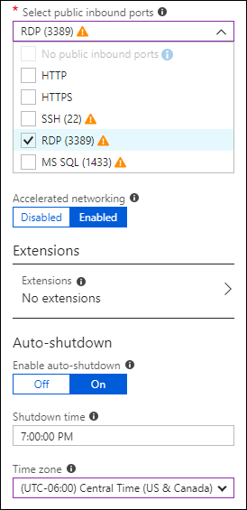
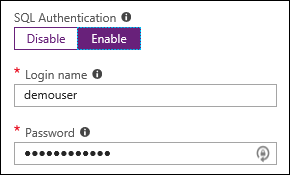
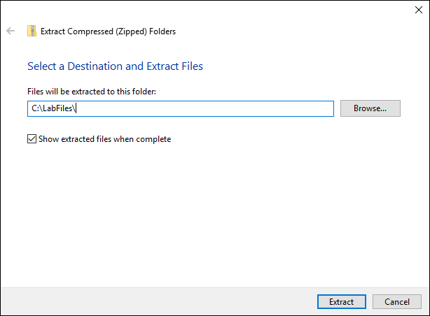
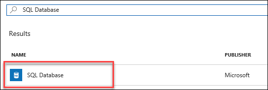

<div class="MCWHeader1">
Migrate EDW to Azure SQL Data Warehouse
</div>

<div class="MCWHeader2">
Before the hands-on lab setup guide
</div>

<div class="MCWHeader3">
May 2018
</div>


Information in this document, including URL and other Internet Web site references, is subject to change without notice. Unless otherwise noted, the example companies, organizations, products, domain names, e-mail addresses, logos, people, places, and events depicted herein are fictitious, and no association with any real company, organization, product, domain name, e-mail address, logo, person, place or event is intended or should be inferred. Complying with all applicable copyright laws is the responsibility of the user. Without limiting the rights under copyright, no part of this document may be reproduced, stored in or introduced into a retrieval system, or transmitted in any form or by any means (electronic, mechanical, photocopying, recording, or otherwise), or for any purpose, without the express written permission of Microsoft Corporation.

Microsoft may have patents, patent applications, trademarks, copyrights, or other intellectual property rights covering subject matter in this document. Except as expressly provided in any written license agreement from Microsoft, the furnishing of this document does not give you any license to these patents, trademarks, copyrights, or other intellectual property.

The names of manufacturers, products, or URLs are provided for informational purposes only and Microsoft makes no representations and warranties, either expressed, implied, or statutory, regarding these manufacturers or the use of the products with any Microsoft technologies. The inclusion of a manufacturer or product does not imply endorsement of Microsoft of the manufacturer or product. Links may be provided to third party sites. Such sites are not under the control of Microsoft and Microsoft is not responsible for the contents of any linked site or any link contained in a linked site, or any changes or updates to such sites. Microsoft is not responsible for webcasting or any other form of transmission received from any linked site. Microsoft is providing these links to you only as a convenience, and the inclusion of any link does not imply endorsement of Microsoft of the site or the products contained therein.

© 2018 Microsoft Corporation. All rights reserved.

Microsoft and the trademarks listed at <https://www.microsoft.com/en-us/legal/intellectualproperty/Trademarks/Usage/General.aspx> are trademarks of the Microsoft group of companies. All other trademarks are property of their respective owners.

**Contents**

<!-- TOC -->

- [Migrate EDW to Azure SQL Data Warehouse before the hands-on lab set up guide](#migrate-edw-to-azure-sql-data-warehouse-before-the-hands-on-lab-set-up-guide)
    - [Task 1: Deploy the source environment](#task-1-deploy-the-source-environment)
    - [Task 2: Configure the SQL Server](#task-2-configure-the-sql-server)
    - [Task 3: Deploy an Azure SQL Database](#task-3-deploy-an-azure-sql-database)

<!-- /TOC -->

## Migrate EDW to Azure SQL Data Warehouse before the hands-on lab set up guide

In this exercise, you will deploy the source environment for this lab. The source environment is designed to represent the existing on-premises environment you will migrate to Azure SQL Data Warehouse.

### Task 1: Deploy the source environment

1.  Browse to the Azure Portal at <https://portal.azure.com>

2.  Click **+Create a resource,** and type **SQL Server 2016** in the search box. Choose the latest service pack version of **Free License: SQL Server 2016 SP2 Developer on Windows Server 2016** from the search results. 

3.  Click the **Create** button to begin deployment of the SQL Server

4.  On the Basics blade, use the following configurations:

    -   Name: **SQLcohoDW**

    -   VM disk type: **SSD**

    -   User name: **demouser**

    -   Password: **Demo\@pass123**

    -   Subscription: ***Your subscription***

    -   Resource Group: **Create new** - **CohoOnPremEnvironment**

    -   Location: ***Choose a location near you***

5.  On the size blade, choose **D2s\_v3**. If this option is not available in your chosen region, choose DS2\_V2.

    

6.  On the Settings blade, select **RDP (3389)** in the **Select public inbound ports** dropdown and change the Auto-shutdown time zone to reflect your current time zone. Then, click **OK**.

    

7.  On the SQL Server settings blade, enable SQL Authentication, and click **OK**

    

8.  On the Summary blade, review your settings. Then, click **Create**.

### Task 2: Configure the SQL Server

1.  Login to the **SQLcochoDW** virtual machine you created in the previous task

    

2.  From Server Manager, click on **Local Server** select **IE Enhanced Security Configuration,** and set it to **Off**

    

    

3.  Install the Azure PowerShell command-line tools from:

    <https://www.microsoft.com/web/handlers/webpi.ashx/getinstaller/WindowsAzurePowershellGet.3f.3f.3fnew.appids>

4.  Open **Windows PowerShell ISE**, copy and paste the following code into the script window and execute it by clicking the green button. The picture below shows the code properly pasted into the script window. Verify that your code does not have any extraneous line wrapping. 

    ```
    $Path = $env:TEMP; 
    $Installer = "chrome_installer.exe"
    Invoke-WebRequest "http://dl.google.com/chrome/install/375.126/chrome_installer.exe" -OutFile $Path\$Installer
    Start-Process -FilePath $Path\$Installer -Args "/silent /install" -Verb RunAs -Wait
    Remove-Item $Path\$Installer
    ```

    

5.  Open **File Explorer,** and create two new folders called **C:\\LabFiles, C:\\Migration**

5.  Download the Student Files from <http://cloudworkshop.blob.core.windows.net/migrate-edw/StudentFiles-06-2018.zip>, and extract the files to **C:\\LabFiles**

    

6.  Launch **SQL Server Management Studio,** and connect to the SQLcohoDW instance

7.  Open a **New Query** window, and cut/paste the following code into the window

    ```
    RESTORE DATABASE CohoDW FROM DISK = 'C:\LabFiles\CohoDW.bak' 
    WITH MOVE 'CohoDW_Data' TO 'F:\Data\CohoDW_Data.mdf'
       , MOVE 'CohoDW_Log' TO 'F:\Log\CohoDW_Log.ldf'
    ```

9.  Click **Execute** to restore the database

     

### Task 3: Deploy an Azure SQL Database

1.  Browse to the Azure Portal and authenticate at <https://portal.azure.com/>

2.  Click **+Create a resource** and type **SQL Database** in the search box. Choose **SQL Database** from the results\
    \
    

3.  Click **Create** on the SQL Database blade. Specify the following information, and click **Create**.

    -   Database name: **cohoOLTP**

    -   Subscription: **Your subscription**

    -   Resource group: **Create new** - **CohoOLTP**

    -   Select source: **Sample (AdventureWorksLT)**

    -   Server: ***Create a new server***

        -   Server name: ***Choose a unique name***

        -   Server admin login: **demouser**

        -   Password: **Demo\@pass123**

        -   Location: ***The same location you used for your other resources***

        -   Allow azure services to access server: ***checked***

    -   Pricing tier: **S1**

         

You should follow all steps provided _before_ performing the Hands-on lab.
