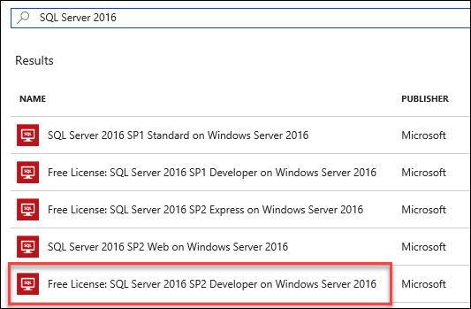
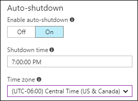
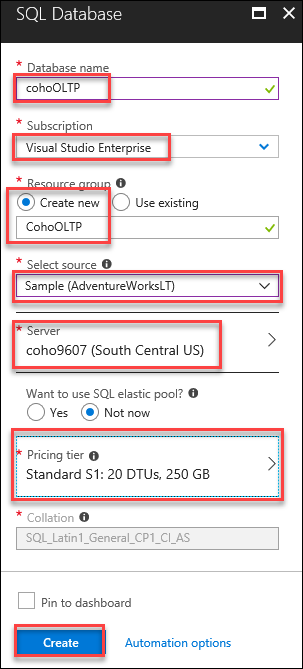

# Migrate EDW to Azure SQL Data Warehouse setup

## Requirements

-   Microsoft Azure subscription

## Before the hands-on lab

In this exercise, you will deploy the source environment for this lab. The source environment is designed to represent the existing on-premises environment you will migrate to Azure SQL Data Warehouse.

### Task 1: Deploy the source environment

1.  Browse to the Azure Portal at <https://portal.azure.com>

2.  Click **+Create a resource,** and type **SQL Server 2016** in the search box. Choose the latest service pack version of **Free License: SQL Server 2016 SP2 Developer on Windows Server 2016** from the search results. 

3.  Click the **Create** button to begin deployment of the SQL Server

4.  On the Basics blade, use the following configurations:

    -   Name: **SQLcohoDW**

    -   VM disk type: **SSD**

    -   User name: **demouser**

    -   Password: **Demo\@pass123**

    -   Subscription: ***Your subscription***

    -   Resource Group: **Create new** **OnPremisesEnvironment**

    -   Location: ***Choose a location near you***

5.  On the size blade, choose **D2s\_v3**. If this option is not available in your chosen region, choose DS2\_V2.

    

6.  On the Settings blade, change the Auto-shutdown time zone to reflect your current time zone. Then, click **OK**.

    

7.  On the SQL Server settings blade, enable SQL Authentication, and click **OK**.

    

8.  On the Summary blade, review your settings. Then, click **Create**.

### Task 2: Configure the SQL Server

1.  Login to the **SQLcochoDW** virtual machine you created in the previous task

    

2.  From Server Manager, click on **Local Server** select **IE Enhanced Security Configuration,** and set it to **Off**

    

    


3.  Install the Azure PowerShell command-line tools from:

    <https://www.microsoft.com/web/handlers/webpi.ashx/getinstaller/WindowsAzurePowershellGet.3f.3f.3fnew.appids>

4.  Open **File Explorer,** and create two new folders called **C:\\LabFiles, C:\\Migration**

5.  Download the Student Files from <http://cloudworkshop.blob.core.windows.net/migrate-edw/StudentFiles-06-2018.zip>, and extract the files to **C:\\LabFiles**

    

6.  Launch **SQL Server Management Studio,** and connect to the SQLcohoDW instance

7.  Open a **New Query** window, and cut/paste the following code into the window

    ```
    RESTORE DATABASE CohoDW FROM DISK = 'C:\LabFiles\CohoDW.bak' 
    WITH MOVE 'CohoDW_Data' TO 'F:\Data\CohoDW_Data.mdf'
       , MOVE 'CohoDW_Log' TO 'F:\Log\CohoDW_Log.ldf'
    ```

9.  Click **Execute** to restore the database

    

### Task 3: Deploy an Azure SQL Database

1.  Browse to the Azure Portal and authenticate at <https://portal.azure.com/>

2.  Click **+Create a resource** and type **SQL Database** in the search box. Choose **SQL Database** from the results\
    \
    

3.  Click **Create** on the SQL Database blade. Specify the following information, and click **Create**.

    -   Database name: **cohoOLTP **

    -   Subscription: **Your subscription**

    -   Resource group: **Create new** - **CohoOLTP**

    -   Select source: **Sample (AdventureWorksLT)**

    -   Server: ***Create a new server***

        -   Server name: ***Choose a unique name***

        -   Server admin login: **demouser**

        -   Password: **Demo\@pass123**

        -   Location: ***The same location you used for your other resources***

        -   Allow azure services to access server: ***checked***

    -   Pricing tier: **S1**

         
